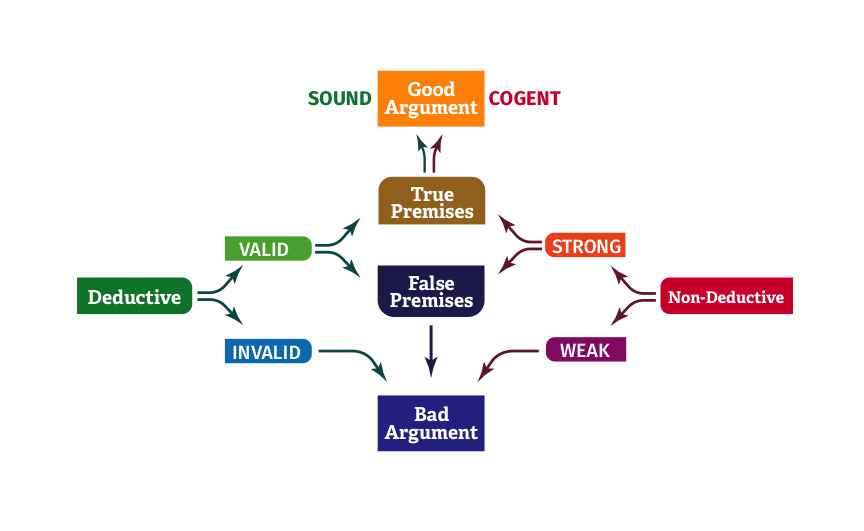

# PHIL 105G Notes

## Obstacles to critical thinking

**Confirmation bias** is a tendency that people prefer information that confirms their existing opinions.

A **reasoning heuristic** is a mental shortcut we use to simplify decision making.

The **availability heuristic** is the judging the probability of an event by how easily examples come to mind.

The **framing effect** is where changes in how a question is posed results in changes in the chosen answer.

## Arguments

A **statement** is a sentence that is either true or false.

An **argument** is a group of statements including premises and a conclusion.  
**Premises** are statements that support the conclusion.  
The **conclusion** is the outcome of the argument.  

A **deductive** argument is one for which the premises are offered to provide logically conclusive support for its conclusion.  
A **non-deductive** argument is an argument for which the premises are offered to provide probable, but not conclusive support for its conclusions.

A **valid** argument is a deductive argument that succeeds in providing decisive logical support.  
An **invalid** argument is a deductive argument that fails in providing conclusive logical support.

A **strong** argument is a non-deductive argument that succeeds in providing probable, but not conclusive, logical support for its conclusion.  
A **weak** argument is a non-deductive argument that fails to provide probable support for its conclusion.

A **counter-example** to an argument is a situation that shows that the argument can have true premises and a false conclusion.

An argument is valid / strong if and only if there are no counter-examples to the argument.

A **sound** argument is a deductive argument that has true premises.  
A **cogent** argument is a strong non-deductive argument that has true premises.

A **good** argument is one which is sound or cogent.  
A **bad** argument is one which is invalid, weak or has false premises.

## Fallacies
The **ad hominem fallacy** is when an arguer attacks the person rather than evaluating the argument on its merits.  

The **red herring fallacy** is when an arguer side-tracks the audience with an irrelevant issue.

The **straw-man fallacy** is when an arguer distorts and attacks a weaker version of their opponent’s argument.

The **false dilemma fallacy** is when an arguer presents only two options and restricts the possibility of more options.

## Scientific Method
1. Identify a problem or pose a question.
2. Devise hypothesises to explain the event or phenomenon.
3. Derive a test for the hypothesis.
4. Perform the test.
5. Accept or reject the hypothesis.

Tests can lead us to reject a hypothesis, but not to conclude that it's true.

A scientific hypothesis is an explanation based on observable evidence requires that it can be testable and falsifiable.

**Inference to the best explanation** is a non-deductive argument which selects the best hypothesis that explains the observations.
